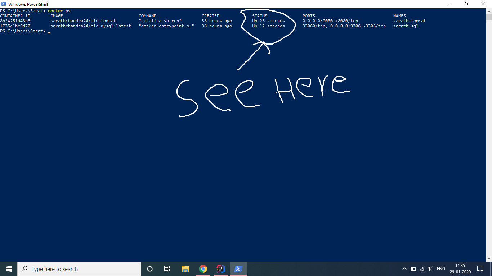
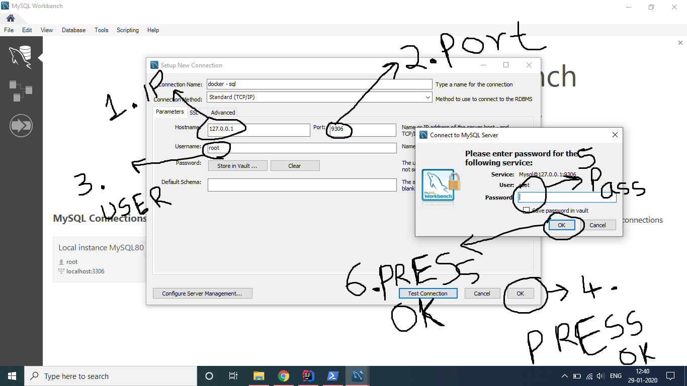
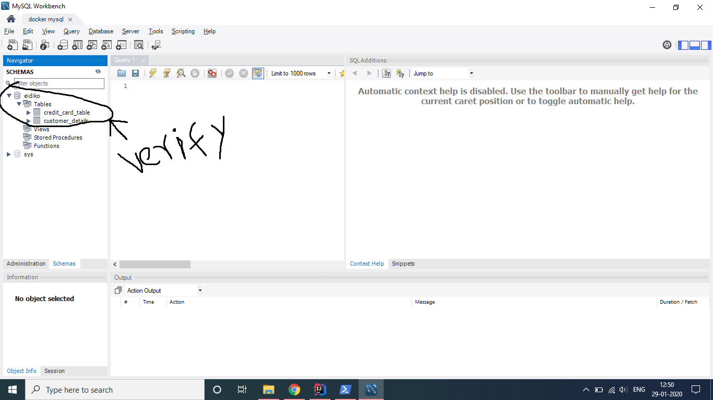
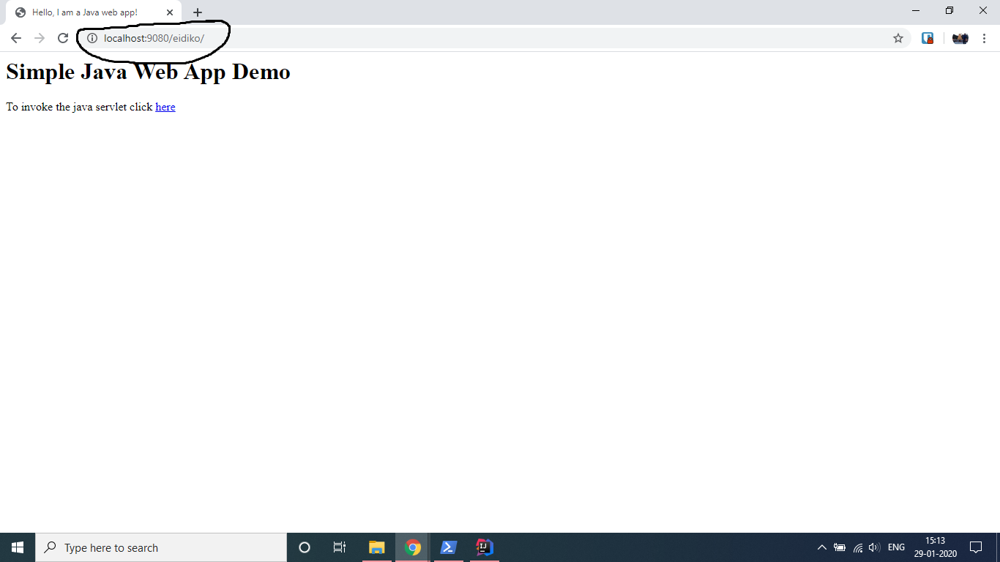

# Building containers and migrating them to cloud

Containers are a form of operating system Virtualization Technology. 
Before Containers there is the use of virtual machines. 
But they are heavy weight and each virtual machine has its own Guest OS and their own kernel whereas the Containers use the host OS kernel and is much lighter in size when compared to Virtual Machines. 
Containers can be build and run in seconds. 
Building containers for the products that are extensively used by companies can help them in building their applications more scalable. 
The main aim of the project is to build containers for the following products MySQL and Servlet Project.
* In future this project is extended for deploying IBM Product Applications
* At present we are dealing the deployment of Tomcat Servlet and MySQL on cloud 

## Getting Started

Clone this project and open it in any of your favourite IDE. 
Please see the Prerequisites that are necessary. 
Missing any od them may cause error or stop the process flow.


### Prerequisites
* Knowledge of OS
* Knowledge of Namespace

1. [Docker](http://docker.com/)
2. [Azure](https://azure.microsoft.com/en-us/) or [AWS](https://aws.amazon.com/) or [GCP](https://cloud.google.com/) cloud account, You can use any cloud service provider for my use I am using [IBM Cloud Account](http://cloud.ibm.com)
3. [Kubernetes](https://kubernetes.io/) service on [cloud provider](https://kubernetes.io/docs/concepts/cluster-administration/cloud-providers/).  I am using [IBM Cloud Kubernetes service](https://cloud.ibm.com/kubernetes/catalog/cluster) 


### Installing

1. Installing Docker :- Please refer to the following [document](https://docs.docker.com/install/) for Docker installation.
2. Signing up to cloud. [IBM Cloud](https://cloud.ibm.com/docs/account?topic=account-signup) , [Azure](https://azure.microsoft.com/en-in/get-started/webinar/), [AWS](https://aws.amazon.com/getting-started/) and [GCP](https://cloud.google.com/gcp/getting-started).
3. Creating Kubernetes service [IBM Cloud Kubernetes Service](https://cloud.ibm.com/docs/containers?topic=containers-getting-started).
4. Refer to [IBM Cloud CLI](https://cloud.ibm.com/docs/cli?topic=cloud-cli-getting-started) for installing the IBM Cloud CLI on your machine.

### Setting up the IBM CLOUD CLI 
   #### For Linux
    ----- For Linux -----
        curl -sL https://ibm.biz/idt-installer | bash
    ----- For windows -----
        [Net.ServicePointManager]::SecurityProtocol = "Tls12, Tls11, Tls, Ssl3"; iex(New-Object Net.WebClient).DownloadString('https://ibm.biz/idt-win-installer')  
   
    ibmcloud plugin install container-registry -r Bluemix
   
    
   
    


## Local Deployment
* Docker setup
    
        docker login
        #create a network in docker
        docker network create --subnet=172.18.0.0/16 <dock-servlet_default>
    
* MySQL Container
    1. Open ```dock-servlet/sql/Dockerfile```
    2. Here I used my own SQL file (```dump.sql```). Please use your own SQL file
    3. After that open Terminal and go to the Dockerfile location
    4. Building MySQL Image 
    
            docker build -t <docker_usernamr>/<repository_name>:<tag> . 
            docker build -t  sarathchanda24/mysql:latest .
        
    5. Running the Image (Containers)
       
            docker run --net <Network Name> --ip <Ip address for the MySQL Container> -p <External Port for testing>:<Containers MySQL Port(Default is 3306)> --name <container name> <Registry name>/<Image name>:<image tag> .
            docker run --net dock-servlet_default --ip 172.18.0.6 -p 9306:3306 --name sarath-sql sarathchandra24/mysql:latest .
       
**Please note the IP address and this is the same IP for the Mysql in Docker network and Paste it in ```src/dbs/CredentialsOfDataBase.java```**

* WAR file generation
    1. Open the project in your IDE
    2. Right click on the project and ```export``` it as ```WAR```
    3. Note the ```WAR FILE LOCATION```  
 
* Tomcat Container
    1. open ```dock-servlet/Dockerfile```
    2. Specify the location of the ```WAR File``` at ```COPY <WAR lOCATION> <DESTINATION WAR NAME> ```
    3. After that open Terminal and go to the Dockerfile location

    4. Building Tomcat Image 
         
            docker build -t <docker_username>/<repository_name>:<tag> . 
            docker build -t  sarathchanda24/tomcat:latest .
        
    5. Running the Image (Containers)
        
            docker run --net <Network Name> --ip <Ip address for the Tomcat Container> -p <External Port for Container (testing)>:<Containers Tomcat Port(Default is 8080)> --name <container name> <Registry name>/<Image name>:<image tag> .
            docker run --net dock-servlet_default --ip 172.18.0.5 -p 9080:8080 --name sarath-tomcat sarathchandra24/tomcat:latest .
        
## Testing
   ### Containers running or not running
   ```docker ps``` or ```docker container ls```
    
   
   * If they are running then directly go to MySQL Database Testing.
   * If they are not running then try to solve with the Exited code mentioned after typing the command
       ```docker container ls -a``` or ```docker ps -a``` 
   ### MySQL Database Testing
   1. Open MySQL WorkBench
   2. Do the following as showed in Image
    
   3. Check whether the Database and tables exist
    
   ### Tomcat Testing
   1. Pull up your favourite Web Browser
   2. Type ```https://<IP Address>:<port as mentioned above>/<war-filename>```. Example [localhost:9080/eidiko](http://localhost:9080/eidiko)
    
## Deployment on IBM cloud kubernetes Service
 ### IBM CLI setup for pushing images
  * login to IBM Cloud CLI 
   
        ibmcloud login        
        #  Signin with your IBM Cloud credentials
  * Setup the container registry 
        
        ibmcloud cr login                 
        #  This make you signin to your IBM Cloud Registry and note the CR address like us.icr.io
  * Add NameSpace to your Registry 
        
        ibmcloud cr namespace-add eid-pro
        #  This will create a name space in your registry
  * Verify the NameSpace is present
        
        ibmcloud cr namespace-list
        #  This will display the namespaces in your cloud
  * See the storage clusters
    
        ibmcloud cs clusters
        #  This will display all your clusters that are in IBM Cloud
        #  Note down the cluster name
  * Public credentials of the Cluster 
        ibmcloud cs workers <cluster name>
        #  This will display the public IP of the cluster note it down
  * setup the kubernetes connection from your local machine to cluster      
        
        ibmcloud cs cluster config <cluster name>
        #  Now this asks to add kubectl to path, copy and paste it in your terminal. Now you can access kubectl
         
  * login to your docker
  
        docker login
        #  log-in with your docker credentials   
 ### Pushing MySQL to IBM Cloud Kubernetes Service
  go to ```dock-servlet/sql/```
  
  * Building image   
        
        docker build --tag <CR address>/<namespace>/<image_name> .
        #  Example: docker build --tag us.icr.io/eid-pro/mysql .
        #  This lets you build the mysql image which is same as the previously built sarathchandra/mysql image
  * Pushing image to the cloud
  
        docker push <CR address>/<name_space>/<image_name>
        #  Example: docker push us.icr.io/eid-pro/mysql
        #  This will push the image into your Cloud Registry
  * Running it on Kubernetes
    
        kubectl run <container-name> --image=<CR address>/<namespace>/<image_name>
        #  Example: kubectl run mysql --image=us.icr.io/eid-pro/mysql
  * Verify the container is running or not
        
        kubect get pods
        #  This will display all the the running containers. 
        #  Check whether the container is running 
  * Expose the Container 
 
        kubectl expose deployment/<container-name> --type="NodePort" --port=<port Number>
        #  Example: kubectl expose deployment/mysql --type="NodePort" --port=3306
  * Container Description
        
        kubectl describe service <container_name>
        #  Example: kubectl describe service mysql
        #  Note the internal IP for tomcat communication
        #  Note the NodePort
* For testing the MySQL database use ```Public IP``` & ```Node Port```, Do [Mysql Database Testing](#mysql-database-testing)
 ### Pushing Tomcat to IBM CLoud Kubernetes Service
  * go to ```dock-servlet/```
  * update CredentialsOfDataBase.java with the credentials of container

  * Building image   
        
        docker build --tag <CR address>/<namespace>/<image_name> .
        #  Example: docker build --tag us.icr.io/eid-pro/tomcat .
        #  This lets you build the Tomcat image which is same as the previously built sarathchandra/tomcat image
  * Pushing image to the cloud
  
        docker push <CR address>/<name_space>/<image_name>
        #  Example: docker push us.icr.io/eid-pro/tomcat
        #  This will push the image into your Cloud Registry
  * Running it on Kubernetes
    
        kubectl run <container-name> --image=<CR address>/<namespace>/<image_name>
        #  Example: kubectl run tomcat --image=us.icr.io/eid-pro/tomcat
  * Verify the container is running or not
        
        kubect get pods
        #  This will display all the the running containers. 
        #  Check whether the container is running 
  * Expose the Container 
 
        kubectl expose deployment/<container-name> --type="NodePort" --port=<port Number>
        #  Example: kubectl expose deployment/tomcat --type="NodePort" --port=8080
  * Container Description
        
        kubectl describe service <container_name>
        #  Example: kubectl describe service tomcat
        #  Note the NodePort
* For testing the Tomcat Service use ```Public IP``` & ```Node Port```, Do [Tomcat Testing](#tomcat-testing) 

      


## Built With

* [Java 13](https://openjdk.java.net/projects/jdk/13/) - Programming Language used
* [Docker](https://http://docker.com//) - containers creation
* [Kubernetes](https://kubernetes.io/docs/tutorials/kubernetes-basics/) - container-orchestration system
* [IBM Cloud Kubernetes Service](https://www.ibm.com/cloud/container-service/) - Cloud service provider and Kubernetes Service used  


## Authors

* **Sarath Chandra Oruganti**  - [SarathChandra24](https://github.com/SarathChandra24)
